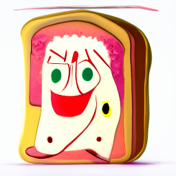

# Mr. Salami Sandwich
Once upon a time, there once was a sandwich named Mr. Salami Sandwich. He was made from two pieces of sourdough bread and had salami in the middle of his body. 



This is a story generation codebase that takes an input prompt and creates audio dialogs as an MP3 file of the characters from the story.

## Notes
This is all a big hack right now... nothing to see yet. This repository uses OpenAI and AWS services right now. Maybe one day I'll use EleutherAI's GPT-J and Coqui's TTS so it all runs locally; however, OpenAI and AWS run pretty quickly. Feel free to submit a PR if folks want to add that support (as an option in `settings.toml`).

### Step 1 - Account Setup
(a) Sign-up (if you haven't already) to [Open AI](https://openai.com/api/)
(b) Ensure the `aws` CLI is in your path and you have IAM permissions for Polly. (I'm just executing shell commands here, no boto3 dependency)
(c) Ensure `ffmpeg` is in your path too

### Step 2 - Setup the key & run make!

Now you can run the setup.sh script (look at it before you run it), save your OpenAI key, source it, and run make!
```
./setup.sh
echo "export OPENAI_API_KEY=\"{YOUR_OPENAI_API_KEY}\"" > key.sh
source key.sh
make
```

Be sure to look at `settings.toml` for various options, including a "rerun" feature that creates longer stories from the final lines of a previously generated prompt.
